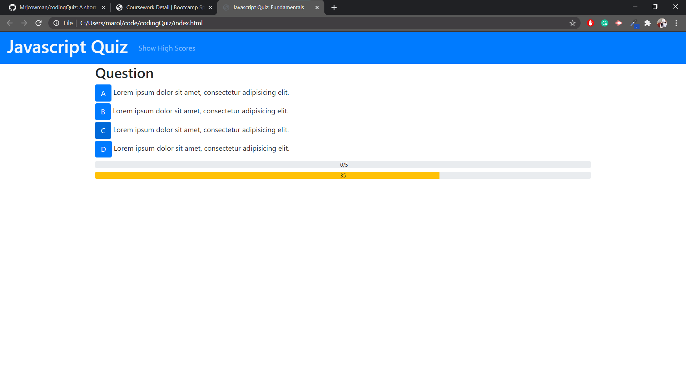

# Coding Quiz

## Description
This is a fun little quiz to test your javascript fundamentals know-how! You have a limited time to play, and the faster you complete it, the higher your score!

[Deployed Site: mrjcowman.github.io/codeQuiz](https://mrjcowman.github.io/codingQuiz/)

## Credits
Thanks to the [Bootstrap](https://getbootstrap.com/) team for making the design of this mobile-friendly site simple.
Thanks to Github for making the deployment of this site simple as well.

## Status
 

